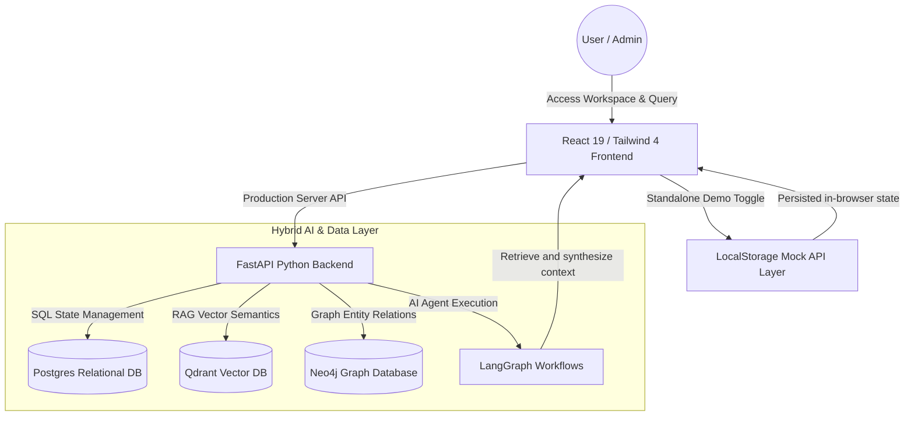

# DocAI: Advanced Hybrid Graph-Vector RAG Platform 🚀
**Live Demo URL: [Launch Live Netlify Demo](https://do-cai.netlify.app/)**

DocAI is a high-performance, enterprise-grade **Retrieval-Augmented Generation (RAG)** SaaS platform designed for deep document intelligence. It leverages a modern, dual **Hybrid Graph-Vector** database architecture to analyze complex relationships and extract context-aware insights from enterprise documents.

Built with role-based access control, PostgreSQL data models, and a **LangGraph-powered AI pipeline**, it also includes an **interactive standalone browser demo mode**—ideal for immediate portfolio review and static hosting platforms like Netlify.

---

## 🌟 Key Features

*   🧠 **Hybrid Knowledge Graph & Vector Retrieval**: Seamlessly combines **Neo4j Graph Databases** (entity and relationship networks) with **Qdrant Vector DB** (semantic search embeddings) for extremely precise, cross-referenced answers.
*   🏢 **Enterprise Multi-Tenancy & RBAC**: Strict Role-Based Access Control protecting organization workspaces. Preloaded and custom-defined dashboards for **Super Admins**, **Organization Admins**, and **Regular Users**.
*   💬 **LangGraph AI Workflows & Session Memory**: Orchestrated via **LangChain** and **LangGraph** to support stateful multi-turn chat sessions, active document querying, and smart query enhancements.
*   📁 **Multi-Format Document Parsing**: High-fidelity parsing of PDFs, Word files (`.docx`), CSV sheets, and Excel spreadsheets (`.xlsx`) with automatic indexing.
*   📊 **Automated Dashboard Metrics & Charts**: Generates relevant metrics and base64 analytics charts dynamically based on chat session insights.
*   🕹️ **Zero-Server Standalone Demo Mode**: Integrated mockup API layer utilizing browser `localStorage` persistence. Experience the entire CRUD project management, user management, and AI chatbot workflow in a live static deployment!

---

## 🏗️ Architecture & Data Flow



---

## 🛠️ Technology Stack

### Frontend
*   **React 19** & **Vite** — Optimized rendering, client-side SPA routing, and hot module reloading.
*   **Tailwind CSS 4** — State-of-the-art styling system featuring curated HSL dark colors and glassmorphic designs.
*   **Lucide React Icons** & **Recharts** — Premium vector icons and dynamic analytics charting.

### Backend
*   **FastAPI** & **Uvicorn** — Ultra-fast, asynchronous Python web API framework.
*   **SQLAlchemy** & **Pydantic** — Robust ORM schemas and reliable data type parsing.
*   **LangChain** & **LangGraph** — AI agent flow engineering and conversational memory tracking.

### Databases & Infrastructures
*   **Neo4j Graph DB** — Complex property relationship matching.
*   **Qdrant Vector DB** — High-performance semantic similarity scoring.
*   **PostgreSQL** — Structural data persistence (users, orgs, permissions).

---

## 🎨 Standalone Demo Mode & Quick Logins

To enable immediate, zero-configuration evaluation by managers and hiring teams, DocAI features a premium **global environment switcher** visible on every page. 

By default, the platform boots in **Demo Mode**, enabling fully client-side CRUD execution:
*   Add and delete projects, upload files, and alter workspace permissions.
*   Create new chat sessions and talk to a smart, simulated document intelligence bot.
*   Register new users, manage active states, and create new organizations.

### ⚡ Click-to-Login Recruiter Profiles
On the login screen, three cards display pre-configured profiles representing each system role. Click any card to **automatically fill credentials and log in instantly**:
1.  👑 **Super Admin** (`superadmin@docai.com` | `admin123`) — Oversee active organizations, system administrators, and global project allocations.
2.  🛡️ **Organization Admin** (`orgadmin@docai.com` | `org123`) — Manage user listings inside your organizational unit and oversee all documents.
3.  👤 **Regular User** (`user@docai.com` | `user123`) — Upload file guidelines, perform semantic searches, and chat with AI document analysts.

---

## 🚀 Installation & Setup

### Local Backend Setup
1.  Navigate to the backend directory:
    ```bash
    cd backend
    ```
2.  Create and activate a virtual environment:
    ```bash
    python -m venv venv
    source venv/bin/activate  # On Windows: .\venv\Scripts\activate
    ```
3.  Install dependencies:
    ```bash
    pip install -r requirements.txt
    ```
4.  Launch local Docker containers for Neo4j and Qdrant:
    ```bash
    docker-compose up -d
    ```
5.  Configure your environment variables in `.env` and start the server:
    ```bash
    uvicorn main:app --reload
    ```

### Local Frontend Setup
1.  Navigate to the frontend directory:
    ```bash
    cd frontend
    ```
2.  Install dependencies:
    ```bash
    npm install
    ```
3.  Launch the Vite development server:
    ```bash
    npm run dev
    ```

---

Developed by [Abhishek Hiremath](https://github.com/Abhishek-Hiremath-215)
